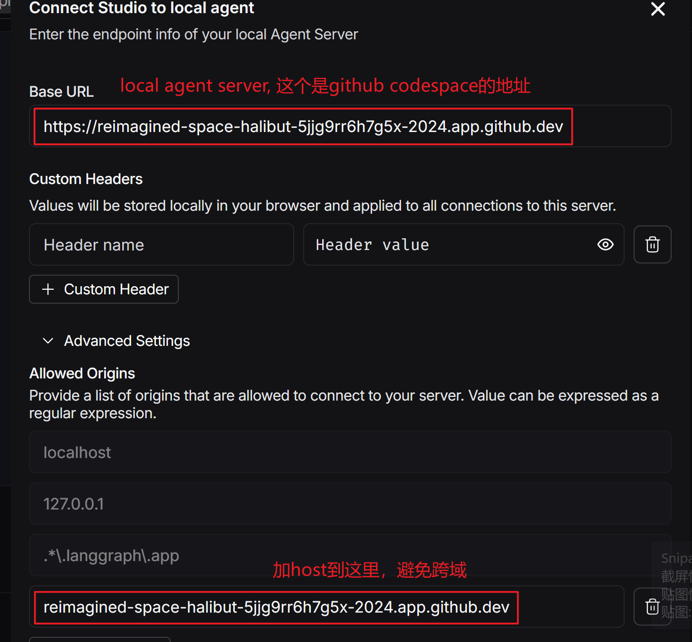

# LangSmith —— LLM 应用的“全生命周期管理平台”

- 可视化
- LangSmith 是 LangChain 官方推出的 SaaS 平台（https://smith.langchain.com）
- 用于 调试、测试、监控、评估和协作开发 LLM 应用
- 支持任何基于 LangChain / LlamaIndex / 自定义框架的 LLM 应用

[官方的定义](https://docs.langchain.com/langsmith/home)
> LangSmith provides tools for developing, debugging, and deploying LLM applications

## LangSmith-studio

[LangSmith-studio配置文档](https://docs.langchain.com/langsmith/local-server)

如果你正在开发 LangGraph Agent，强烈建议立即启用 LangSmith —— 它能让你 10 倍速定位 bind_tools、消息格式、工具返回等问题！

### LnagSmith 启动遇到的cors问题

